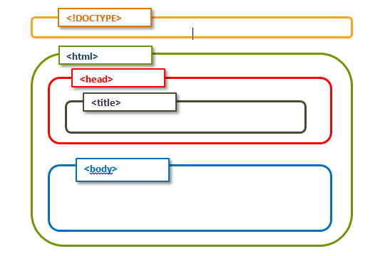

# HTML 
>
#### What is the HTML?
Hypertext Markup Language (HTML) is the standard markup language for documents designed to be displayed in a web browser. It can be assisted by technologies such as Cascading Style Sheets (CSS) and scripting languages such as JavaScript.

Web browsers receive HTML documents from a web server or from local storage and render the documents into multimedia web pages. HTML describes the structure of a web page semantically and originally included cues for the appearance of the document.

### how to use Html?
>
#### Basic Html Structure:


that html using the Tags to write the code and also contain  opining Tag and closing Tag for example 

```
<!DOCTYPE html>
<html lang="en">
<head>
  </head>
<body>
    <header>
    .
          </header>
    <main>
    .
    .
                </main>
    <footar>
    .
              </footer>
</body>
</html>
```
### why we need the HTML?

HTML code ensures the proper formatting of text and images for your Internet browser. Without HTML, a browser would not know how to display text as elements or load images or other elements. HTML also provides a basic structure of the page, upon which Cascading Style Sheets are overlaid to change its appearance.

## css
### what is th CSS ?
>
CSS stands for Cascading Style Sheets. CSS describes how HTML elements are to be displayed on screen, paper, or in other media. CSS saves a lot of work. It can control the layout of multiple web pages all at once.


#### Why we need Css?

CSS is the language for describing the presentation of Web pages, including colors, layout, and fonts. It allows one to adapt the presentation to different types of devices, such as large screens, small screens, or printers. CSS is independent of HTML and can be used with any XML-based markup language.


### how to use CSS?
CSS can be added to HTML documents in 3 ways:

1. Inline - by using the style attribute inside HTML elements.
```
<header style="color: red ;">
    .
          </header>
```
2. Internal - by using a style element in the head section for example 

```
<style>
body {
  background-color: lightblue;
}

h1 {
  color: white;
  text-align: center;
}

p {
  font-family: verdana;
  font-size: 20px;
}
</style>
```
3. External - by using a link element to link to an external CSS file.

```
<!DOCTYPE html>
<html lang="en">
<head>
<link rel="stylesheet" href="file name">
  </head>
<body>
 .
 .
</body>
</html>
```
# JavaScript
### what is JavaScript?

JavaScript is a scripting or programming language that allows you to implement complex features on web pages — every time a web page does more than just sit there and display static information for you to look at — displaying timely content updates, interactive maps, animated 2D/3D graphics, scrolling video jukeboxes, ...

### why we need JavaScript?

JavaScript is a text-based programming language used both on the client-side and server-side that allows you to make web pages interactive.Incorporating JavaScript improves the user experience of the web page by converting it from a static page into an interactive one. To recap, JavaScript adds behavior to web pages.

### how to use JavaScript?
A computer program is a list of "instructions" to be "executed" by a computer.In a programming language, these programming instructions are called statements.
A JavaScript program is a list of programming statements for example:
``` document.getElementById("demo").innerHTML = "Hello Dolly."; ```

#### Semicolons ;
Semicolons separate JavaScript statements. Add a semicolon at the end of each executable statement:
``` 
var a, b, c;     // Declare 3 variables
a = 5;           // Assign the value 5 to a
b = 6;           // Assign the value 6 to b
c = a + b;       // Assign the sum of a and b to c
```
#### JavaScript Values
The JavaScript syntax defines two types of values:
* Fixed values
* Variable values
Fixed values are called Literals.Variable values are called Variables.

#### JavaScript Literals
The two most important syntax rules for fixed values are:

1. Numbers are written with or without decimal
2. Strings are text, written within double or single quotes

#### JavaScript Variables
In a programming language, variables are used to store data values.JavaScript uses the var keyword to declare variables.
An equal sign is used to assign values to variables. In this example, x is defined as a variable. Then, x is assigned (given) the value 6:
```
var x;

x = 6;
```

#### JavaScript Operators
JavaScript uses arithmetic operators ( + - * / ) to compute values:
```
(5 + 6) * 10
```
JavaScript uses an assignment operator ( = ) to assign values to variables:
```
var x, y;
x = 5;
y = 6;
```
#### The JavaScript Switch Statement
Use the switch statement to select one of many code blocks to be executed.

Syntax:
```
switch(expression) {
  case x:
    // code block
    break;
  case y:
    // code block
    break;
  default:
    // code block
}
```
This is how it works:

* The switch expression is evaluated once.
* The value of the expression is compared with the values of each case.
* If there is a match, the associated block of code is executed.
* If there is no match, the default code block is executed.

This example uses the weekday number to calculate the weekday name:
```
switch (new Date().getDay()) {
  case 0:
    day = "Sunday";
    break;
  case 1:
    day = "Monday";
    break;
  case 2:
     day = "Tuesday";
    break;
  case 3:
    day = "Wednesday";
    break;
  case 4:
    day = "Thursday";
    break;
  case 5:
    day = "Friday";
    break;
  case 6:
    day = "Saturday";
}
```
